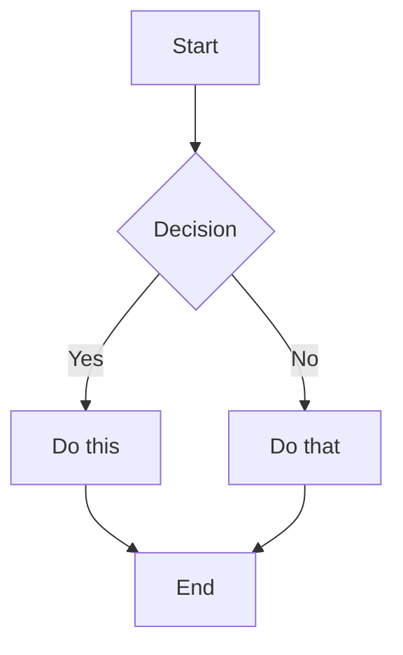

---
tags:
  - "#diagram"
type: "flowchart|sequence|class|er|gantt|mindmap|state"
topic: ""
---
# Diagram: Topic Name

Brief description of what this diagram shows.

---

---

## Notes
- What the diagram represents
- Key components explained
- [[Related Note]]
